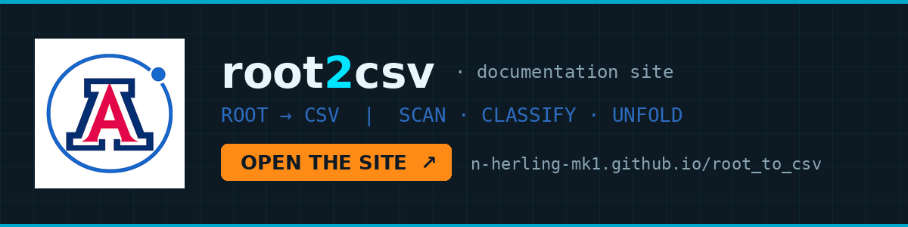

# root2csv

ROOT→CSV tooling for ATLAS ntuples. **Layer 1** scans a file and classifies
every branch (scalar / vec / jagged / jagged-deep / unreadable) into a
manifest; **Layer 2** flattens to CSV — quick single-pass, or manifest-driven
full unfold. **Layer 3** is optional and trims columns by branch name, working
from layer 2's CSV. Pure uproot/awkward, no ROOT build
needed, headless-friendly.

Layers 1 and 2 are the pipeline. Layer 3 is a post-processing step you can
ignore entirely — delete its list and everything else still runs.

Lineage: `flatten_events.py` (2026-04-21), the events.root two-pass
flattener. Design lock-in: `SPEC.txt`.

## The documentation site

[](https://n-herling-mk1.github.io/root_to_csv/)

**Live:** <https://n-herling-mk1.github.io/root_to_csv/> — the full guide:
tiers, the manifest how-to, the ignored-branch list, the six bins, glossary,
and the vetting transcript. Click the banner.

## Install (headless server, via clone)

```bash
git clone <REPO_URL>
cd root2csv
python3 -m pip install --user -r requirements.txt     # or into a venv
```

No ATLAS environment, no ROOT build, no display needed.

## Fastest path: one file → one CSV

```bash
python3 convert.py /data2/kjohns/run3_sample_fastframe_files/<file>.root
```

That's it. Outputs land in `./<name>_scan/`:

| file | what it is |
|---|---|
| `<name>_flat.csv` | the flat CSV (jagged branches exploded to `_0…_N` columns, short events padded with the `-999` flag) |
| `<name>_canonical.parquet` | bulk storage — everything readable, lists kept as lists; regenerate CSVs from this without re-reading ROOT |
| `<name>_manifest.txt` | human-readable audit — what every branch is and what happened to it (Ctrl-F any branch name) |
| `<name>_manifest.json` | machine-readable census; edit per-branch policies here |

Layer 3, if you run it, adds two more:

| file | what it is |
|---|---|
| `<name>_filtered.csv` | the CSV with every branch named in `drop_list.txt` removed |
| `<name>_drop_report.txt` | the audit — every branch matched and how many columns it removed, every listed branch that was empty-bin, and every name that matched nothing |

Useful options: `--tree reco` (default: auto-picks the tree with most
entries) · `--name mySample` · `--out DIR` · `--tag is_signal=1`
(stamp an integer column on every row, repeatable) ·
`--fill x` (legacy events.root sentinel) · `--fill nan` (NaN pads).

## The layers

**Layer 1 — scan only** (census, no CSV):

```bash
python3 scan.py <file>.root
```

**Layer 2 — convert:**

```bash
# 2a QUICK — no pre-scan, default policies (the events.root behavior)
python3 convert.py <file>.root

# 2b FROM-SCAN — edit policies first, then build from the parquet
python3 scan.py <file>.root --name s1 --out ./s1_scan
#   ...edit "policy" per branch in ./s1_scan/s1_manifest.json...
python3 convert.py --from-scan ./s1_scan
```

Jagged policies: `pad_max` (default) · `first:N` (keep first N columns —
kills outlier-driven column explosions) · `drop` (exclude from CSV).
The manifest's `len_med / len_p95 / len_max` per branch shows you where
`first:N` is worth it *before* you build.

**Layer 3 — filter (optional):**

```bash
python3 dropfilter.py ./s1_scan --preview   # resolve + count, write nothing
python3 dropfilter.py ./s1_scan             # -> MM_DD_YY_HHMMSS_filtered.csv
python3 dropfilter.py ./s1_scan --out ./s1_scan/barrel.csv    # or name it
```

Removes whole branches named in `drop_list.txt`. Reads `flat.csv` and writes a
**new** file — `flat.csv`, the manifests and the parquet are all left intact,
so changing your mind costs one re-run with an edited list. No ROOT file
needed, no re-scan, no re-convert, and no uproot: layer 3 is pure stdlib and
runs on a copied-down scan directory.

> **Why not the parquet?** `canonical.parquet` keeps lists as lists, so a
> jagged branch is *one* list-valued column there — not its `N` exploded CSV
> columns. Filtering it would remove one column per branch and leave list
> cells behind. It stays the complete master copy; it just isn't a flat table
> to filter.

### The drop list

`drop_list.txt` **ships with the repo**, at the root beside `scan.py` — there
is nothing to create. Plain text, one **branch** name per line;
`#` comments and blank lines are skipped, inline comments too.

```
# --- Jets (10) ---
jet_pt_NOSYS
jet_eta          # inline comments work
caloCluster_*    # globs resolve against manifest branch names
```

Three rules worth knowing:

- **Branch names, not column names.** Write `trackID_pt`, never
  `trackID_pt_0`. `manifest.json` expands each branch to every column it
  produced — on the vet file that one line removes 487 columns.
- **A name that matches nothing is a hard error.** Nothing is written, the run
  exits non-zero, and the offending line numbers are printed. A typo cannot
  quietly hand you a wider CSV than you asked for. Override with
  `--allow-unmatched`.
- **Matching is anchored on the whole branch name.** `trackID_eta` and
  `track_eta_NOSYS` are different families and never touch each other — but a
  sloppy glob like `track*` eats both.

The list is found automatically from any working directory. Search order,
most specific first: `<scan_dir>/drop_list.txt`, then `./drop_list.txt`, then
the copy beside `dropfilter.py`. `--drop-file` overrides all three. Delete
every copy and layer 3 becomes a clean no-op at exit 0 — layers 1 and 2 are
unaffected.

Full list and rationale: <https://n-herling-mk1.github.io/root_to_csv/pages/ignored.html>

## The six bins

| bin | meaning | CSV fate |
|---|---|---|
| scalar | one value per event | straight through |
| vec1 | length-1 vector every event | collapsed to scalar |
| jagged | variable-length vector | exploded + padded |
| jagged-deep | ndim > 2 (list-of-lists) | parquet only, never CSV |
| empty | zero-length everywhere | skipped |
| unreadable | custom C++ class uproot can't decode | name + reason recorded — that's all that can be done |

## Viewing outputs on a headless server

Three paths, easiest first:

1. **Copy the file down** (from your local machine):
   ```bash
   scp user@server:/path/to/s1_scan/s1_manifest.txt .
   ```
2. **VS Code / code-server in the browser** — see below. Open the scan
   folder, click the files.
3. **Tunnel a tiny web server** (for the stage-C HTML report, later):
   ```bash
   # on the server — 127.0.0.1 bind ONLY, never expose to the network
   python3 -m http.server 8888 --bind 127.0.0.1
   # on your local machine
   ssh -L 8888:localhost:8888 user@server
   # browse to http://localhost:8888
   ```

## code-server (browser VS Code on the headless server)

Already installed? `command -v code-server && code-server --version`

If not (no root needed):

```bash
curl -fsSL https://code-server.dev/install.sh | sh -s -- --method=standalone --prefix=$HOME/.local
export PATH="$HOME/.local/bin:$PATH"
```

Run it (loopback only):

```bash
code-server --bind-addr 127.0.0.1:8080
```

**Password:** auto-generated at first run, stored in
`~/.config/code-server/config.yaml` — read it with:

```bash
cat ~/.config/code-server/config.yaml
```

Local machine, new terminal:

```bash
ssh -L 8080:localhost:8080 user@server
```

Browser → `http://localhost:8080` → paste the password.
Download any file: right-click it in the Explorer sidebar → **Download**.

## Port / tunnel hygiene — before you log out

Rule zero: everything binds `127.0.0.1` only — the ssh tunnel is the
only door. Even so, close up:

```bash
# ON THE SERVER — anything I left listening?
lsof -iTCP -sTCP:LISTEN -a -u $USER
# empty output = clean. Otherwise:
kill <PID>                         # e.g. leftover http.server / code-server
pkill -u $USER -f vscode-server    # optional: clear lingering VS Code remotes
```

Local side: a foreground `ssh -L` tunnel dies when you close its
terminal. Stray backgrounded ones:

```bash
ps aux | grep '[s]sh -L'   # then kill <PID>
```

## Repo layout

```
common.py     shared core: six-bin classifier, profiling, progress UI, IO
scan.py       Layer 1 — census → parquet + manifest.json + manifest.txt
convert.py    Layer 2 — quick (2a) and from-scan (2b) → flat CSV
dropfilter.py Layer 3 — optional; flat.csv + drop_list.txt → filtered CSV
drop_list.txt the branch names layer 3 removes — edit this, not the code
SPEC.txt      stage-A design lock-in (read before changing anything)
index.html    front-end home (TRON light) — the only page at root
pages/        about / tier1 / ignored / tier2 / tier3 / manifest / test1 /
              bins / glossary
assets/       css/tron_light.css · js/site.js · images/ (logo, mark,
              icon, tier screenshots)
```
